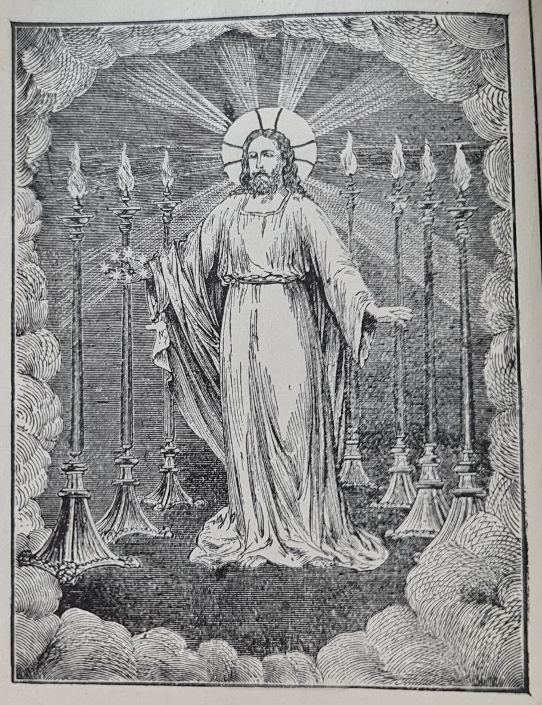

# Introduction

## i

Whilst God was thus dealing with the human race in general, He willed, in his wisdom, to work in a more special way within a narrower circle. At first, history tells of God's particular dealings with individuals and families, as with the patriarchs; then with one nation, that of the Jews; and, lastly, when Christ came, with all nations without distinction.

Taking the Old Testament as our guide, we find in early times Noah thus singled out for God's special favour. The human race had become so utterly wicked, that it was necessary to destroy it by a mighty flood. Noah and his family remained faithful; and, as a reward, God saved them in the ark from the punishment which fell upon the ungodly. With Noah and his family, God made a covenant or agreement,[^1] revealing himself, and giving the primary laws of the human race. Thus the knowledge of the true God was preserved in the world.

But in time the descendants of Noah corrupted themselves, and then God, in his mercy, made choice of Abraham and his family. God now began to reveal himself more fully. He promised in solemn terms that Abraham should be the founder of a great nation, and that in him all families of the earth should be blessed. "Abraham shall surely become a great and mighty nation, and all the nations of the earth shall be blessed in him."[^2]

The nation which sprung from Abraham was chosen by God to be his "peculiar people,"[^3] an elect nation. The nation thus chosen consisted of the Hebrew race, commonly known as the children of Israel, or the Jews.

Shortly after the death of Abraham, a great famine spread over the land of Canaan, where the family of Abraham dwelt. To avoid this famine, all the descendants of Jacob, numbering seventy persons, journeyed into Egypt, and there greatly multiplied. The king of Egypt fearing that, in case of war, they might side with his enemies, reduced them to slavery. From this bondage God rescued his people by the hand of Moses, whom He raised up to be their leader. Under the guidance of Moses the whole nation, now great in number, was led out of Egypt into the wilderness of Sinai, and there organised to form a Church.[^4] To this Church, the whole of the Jewish nation belonged. Thus organised, the Jewish Church received from God the moral law, the right of approaching him by sacrifices, the divine blessing, and, above all, the promise that from their midst should spring in due time the divine Deliverer, the incarnate God himself.

Such were the elect people, "the Israelites, to whom pertaineth the adoption, and the glory, and the covenants, and the giving of the law, and the service of God, and the promises; whose are the fathers, and of whom as concerning the flesh Christ came, who is over all, God blessed for ever."[^5]

As time went on, God raised up the prophets to be the teachers of his people, and by them made known further truths concerning himself, his coming in the flesh, his sufferings and exaltation, and the redemption of the whole human race.

It is true that God's love and mercy were over all nations, yet it was with the Jewish Church that He thus closely dealt. Outside its pale, there was no clear revelation and no special blessing. The Gentiles, i.e., all nations other than the Jews, are described by St. Paul as "aliens from the commonwealth of Israel, and strangers from the covenants of promise."[^6] Our Lord himself declared that "salvation is of the Jews;"[^7] for the Jewish Church was the covenanted sphere of God's favour, and the home of his truth. Though promises to the nations outside the Jewish Church were given, they also depended upon the coming of the Deliverer, the Son of God made man.

## ii

"When the fulness of the time was come, God sent forth his Son, made of a woman, made under the law."[^8] His birth, his sufferings, his rejection, and his exaltation, had been foretold in the Old Testament Scriptures. He came under the law, obeying all its precepts. Jesus Christ did not come to destroy the old Church, and to build a new one on its ruins; but rather He caused the old Church to pass into a higher state of existence. He said,— "Think not that I am come to destroy the law, or the prophets: I am not come to destroy, but to fulfil."[^9] He was born and lived on earth within the bounds of the Jewish Church, with its scriptures, laws, sacrifices, and rites; and in his own person gave to them a fuller meaning, and a new power to save and to heal the souls of men. In his person, and through his grace, the old types passed into new and living realities. Thus the Christian Church grew out of the old religion, as the leaves and flowers of a plant grow out of the stem. The Christian Church lay in the womb of the Jewish Church, and was its offspring. Our Lord himself clearly taught this continuity between the two Churches, by speaking of the Christian Church as "Israel."[^10] There is but one Israel, or chosen people, from the beginning to the end.

God's purposed dealings with mankind through Christ, were too wonderful to be carried into effect without due warning. There was need of long and careful preparation for the Incarnation, and its application in the Christian Church. This preparation was made by God by means of the Jewish Church. Its great work was to prepare the way for Christ, and for God's fullest revelation of truth, and his richest outpouring of grace in Christ. "The law was our schoolmaster to bring us unto Christ."[^11]

The prophecies, types, and figures of the Old Testament find their fulfilment in Christ himself, and the Christian Church.

The revelation of the Old Testament is completed in that of the New Testament.
The old sacrifices are fulfilled in the sacrifice of the Lamb of God on Calvary, and its continual application in the Holy Eucharist.

The moral law in the ten commandments is perfected, and raised to a higher meaning by Christ in the Sermon on the Mount, and made binding upon Christian people.

The priesthood is summed up and perfected in Christ, the great high priest, and continued in the Christian ministry; the hereditary de- scent of the sons of Aaron finding its counterpart in the spiritual descent of the apostolic succession.

The royal priesthood of the Jewish nation finds its expression in the lay priesthood of the Christian Church.

The sacrament of Holy Baptism takes the place of the rite of Circumcision, and the Holy Eucharist of the Jewish Passover.

The fasts and festivals of the Jewish Church make way for those of the Christian Church, whilst the Jewish Sabbath passes into the Christian Sunday.

In short, the old Church was absorbed in the new; and the Jewish religion, filled with new meaning and endowed with new powers, through the coming of God in the flesh, and the outpouring of the Holy Ghost at Pentecost, passed into The Catholic[^12] Religion.

---

>"The religion of which Jesus is the author, and which the Spirit of Jesus founded on the day of Pentecost, was no mere novelty; not a system which arose aside from, and did not fall in with, the main line of the dispensations of God.
>
>The religion of Jesus is the flower, of which the Jewish Church is the bud, and the Patriarchal the stem; it is a true development and outgrowth of earlier principles. Christianity appears as the descendant of a most ancient religion, not merely as its successor, but as the interpreter of its rites, and the key to its prophecies."
>
> \- Hutchings, *The Person and Work of the Holy Ghost*, 4th Ed., p. 108.

---

## Figure: Christ in the Church

"I saw seven golden candlesticks; and in the midst one like unto the Son of Man, and He had in his right hand seven stars... The seven stars are the angels of the seven churches, and the seven candlesticks are the seven churches."—*Rev. i. 12 to end.*

*(Illustration taken, by permission, from Grueber's "Pure Offering.")*

---

[^1]: Gen. ix. 8, etc.
[^2]: Gen. xviii. 18.
[^3]: Deut. xiv. 2.
[^4]: Acts vii. 38.
[^5]: Rom. ix. 4, 5.
[^6]: Eph. ii. 12.
[^7]: St. John iv. 22.
[^8]: Gal. iv. 4.
[^9]: St. Matt. v. 17.
[^10]: St. Matt. xix. 28.
[^11]: Gal. iii. 24.
[^12]: For an explanation of the term Catholic, the reader is referred to page 219.
